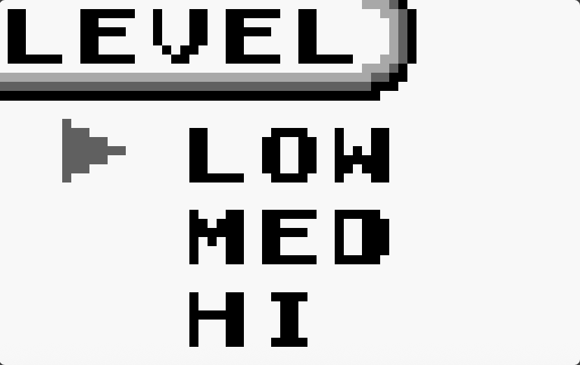
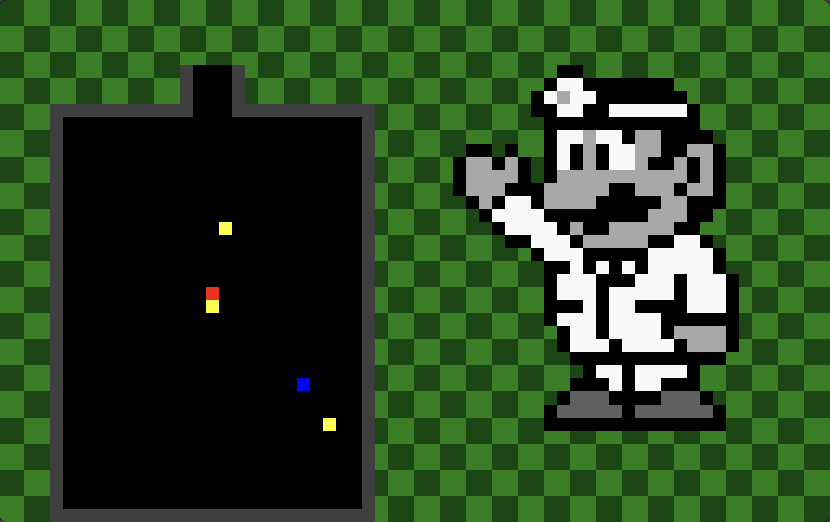
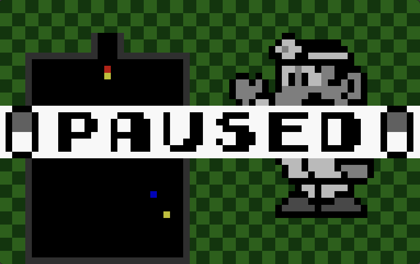
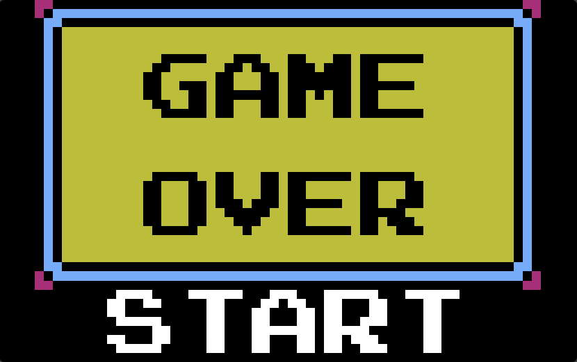

# Dr. Mario (Assembly Project)

A recreation of the classic *Dr. Mario* game built in assembly, featuring real-time gameplay mechanics, difficulty selection, sound effects, and background music.

## Authors
- Kirill Utyashev  
- Michelle Zaporozhets  

## Overview
This project implements a playable version of Dr. Mario using low-level programming concepts. It includes core gameplay systems such as movement, rotation, gravity, collision detecting, and line clearing, along with additional features like difficulty modes, pause functionality, a game over screen, sound effects, and background music.

You can view a short [gameplay video](demo/dr-mario-demo.mov) here.

## Features

### Core Gameplay
- Capsule movement (left/right)
- Capsule rotation
- Gravity system (automatic downward movement)
- Collision detection and landing mechanics
- Row clearing system

### Difficulty System
- Easy, Medium, and Hard modes
- Increasing number of viruses and game speed based on difficulty

### Additional Features
- Gradually increasing gravity speed over time  
- Pause functionality
- Game over screen with retry option  
- Sound effects for:
  - Capsule movement/rotation  
  - Row clearing  
  - Level completion  
  - Game over  
- Background music (Dr. Mario theme)

## Controls

| Key | Action |
|-----|--------|
| `a` | Move left |
| `d` | Move right |
| `w` | Rotate capsule / navigate menu up |
| `s` | Move down faster / navigate menu down |
| `p` | Pause / unpause |
| `q` | Quit game |
| `Enter` | Select option / restart |

## How to Run

To run the game, use the Saturn (MIPS simulator) display tool with the following setup:

1. Open the Bitmap Display in Saturn
2. Configure the display settings:
   - Display Width: `64`  
   - Display Height: `40`  
   - Base Address: `0x10008000`  
   - Unit Width: `1`  
   - Unit Height: `1`  

3. Ensure the following files are in the same directory:
   - `drmario.asm`
   - `drmario-music.asm`

4. Assemble and run `drmario.asm`

## Gameplay Flow

1. Level Select Menu  
   - Choose difficulty (Easy, Medium, Hard)

2. Gameplay  
   - Control falling capsules to match and clear viruses  
   - Increasing speed over time adds challenge  

3. Pause  
   - Press `p` to pause/resume the game  

4. Game Over  
   - Triggered when:
     - All viruses are cleared, or  
     - The bottle is blocked  
   - Press `Enter` to return to menu  

## Screenshots

### Level Select

### Gameplay

### Pause Screen

### Game Over

